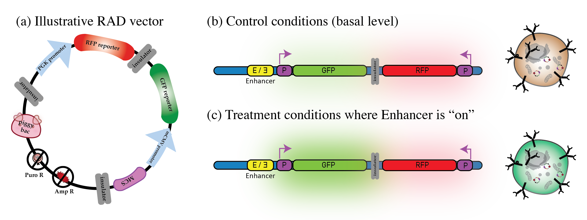

# RADconstruct
Jupyter notebooks for investigating the output for the Regulatory Activity Decoder (RAD) construct developed in Dowell laboratory at CU Boulder. 

More details about the RAD construct can be found in Appendix B of Thesis ["Investigating exogenous stressors impact on transcription in population with Down syndrome"](https://dna.colorado.edu/media/thesis_pdf/WestfallThesis.pdf).
